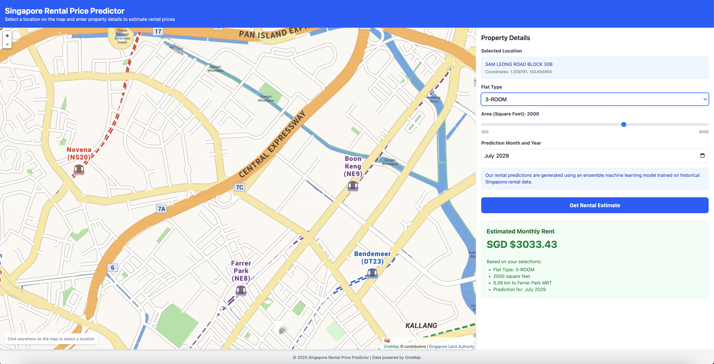

# React + TypeScript + Vite Rental Prediction App

A web application for predicting rental prices based on various housing parameters using machine learning models.



## Getting Started

### Prerequisites

- Python 3.x
- Node.js
- npm or yarn

### Running the Server

1. Navigate to the server root folder:

   ```bash
   cd server
   ```

2. Start the Flask server:
   ```bash
   python main.py
   ```
   The server will run on http://127.0.0.1:5000

### Running the Client

1. Navigate to the client_vite root folder:

   ```bash
   cd client_vite
   ```

2. Install dependencies:

   ```bash
   npm install
   # or
   yarn
   ```

3. Start the development server:
   ```bash
   npm run dev
   # or
   yarn dev
   ```
   The client will run on http://localhost:5173

## Using the Application

1. Select the room location from the dropdown
2. Configure flat type
3. Enter square footage
4. Set prediction month and year
5. Click "Get Rental Estimate" to see the predicted rental price

## Technology Stack

- **Frontend**: React with TypeScript, Vite, and Tailwind CSS
- **Backend**: Python Flask server with machine learning models

## Expanding the ESLint configuration

If you are developing a production application, we recommend updating the configuration to enable type-aware lint rules:

```js
export default tseslint.config({
  extends: [
    // Remove ...tseslint.configs.recommended and replace with this
    ...tseslint.configs.recommendedTypeChecked,
    // Alternatively, use this for stricter rules
    ...tseslint.configs.strictTypeChecked,
    // Optionally, add this for stylistic rules
    ...tseslint.configs.stylisticTypeChecked,
  ],
  languageOptions: {
    // other options...
    parserOptions: {
      project: ["./tsconfig.node.json", "./tsconfig.app.json"],
      tsconfigRootDir: import.meta.dirname,
    },
  },
});
```

You can also install [eslint-plugin-react-x](https://github.com/Rel1cx/eslint-react/tree/main/packages/plugins/eslint-plugin-react-x) and [eslint-plugin-react-dom](https://github.com/Rel1cx/eslint-react/tree/main/packages/plugins/eslint-plugin-react-dom) for React-specific lint rules:

```js
// eslint.config.js
import reactX from "eslint-plugin-react-x";
import reactDom from "eslint-plugin-react-dom";

export default tseslint.config({
  plugins: {
    // Add the react-x and react-dom plugins
    "react-x": reactX,
    "react-dom": reactDom,
  },
  rules: {
    // other rules...
    // Enable its recommended typescript rules
    ...reactX.configs["recommended-typescript"].rules,
    ...reactDom.configs.recommended.rules,
  },
});
```
